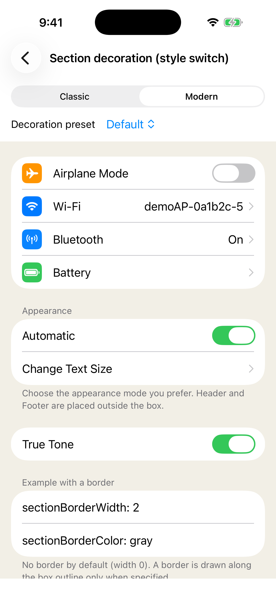
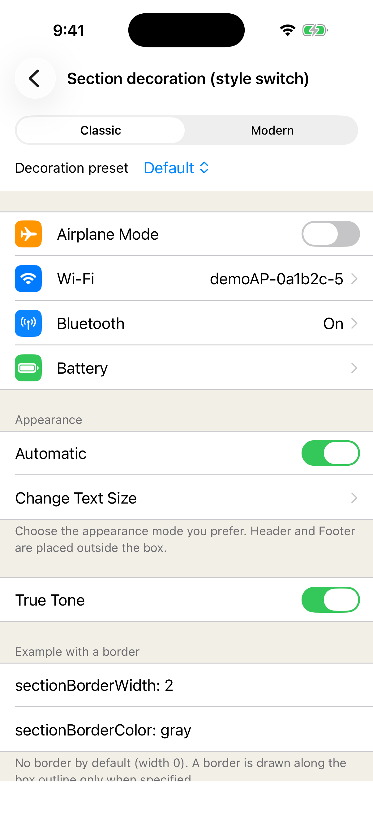
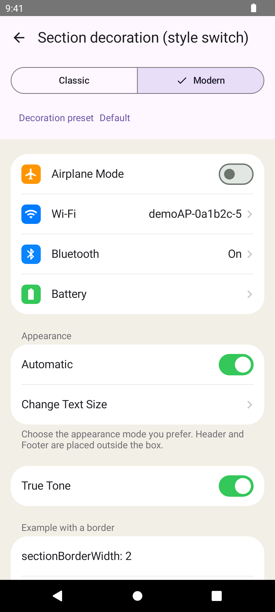
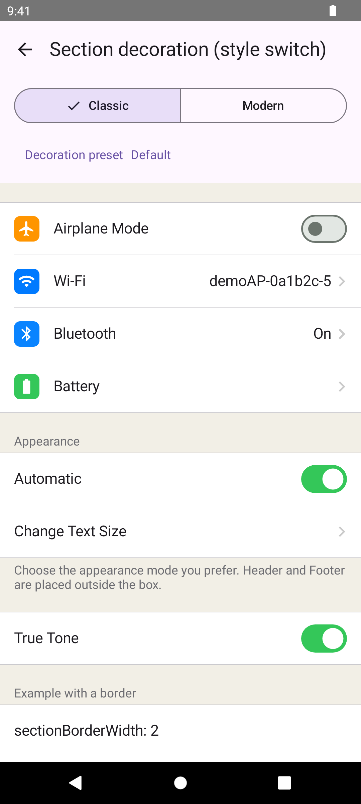

> **配信状況:** 公開配信の準備中です。

# KsSettingsView

[English](README.md)

## 概要と主な特徴

KsSettingsViewは、iOS、Android、.NET MAUIでリスト形式の設定画面を構築するためのクロスプラットフォームUIライブラリです。iOSとAndroidのNative実装が描画と操作モデルを担い、MAUI層は同じ画面をXAMLとC#から利用できる形で公開します。

- SwiftUIとJetpack Composeの宣言的API、およびUIKitとAndroid Viewのhost
- 12種類の組み込みCellと、アプリケーション独自の内容を置ける`CustomCell`
- Storeによる構造・内容の動的更新と、編集可能なCellの双方向値反映
- `Theme`と`CellStyle`によるカスタマイズ、およびClassicとModernのリストstyle
- .NET MAUIから利用する場合も含めた、両platformでのNative描画

バージョンが`0.x`の間は、公開APIに破壊的変更が入る可能性があります。

## スクリーンショット

| Modern | Classic |
| --- | --- |
| **iOS — Modern**<br> | **iOS — Classic**<br> |
| **Android — Modern**<br> | **Android — Classic**<br> |

.NET MAUIはNative実装をラップするため、上記と同じ画面を描画します。

## 対応プラットフォーム

| プラットフォーム | 最低platform | ライブラリが使用するtoolchain |
| --- | --- | --- |
| iOS Native | iOS 16.0 | Swift tools 5.10 |
| Android Native | Android API 29、compileSdk 35 | Kotlin 2.4.10、AGP 8.13.2、Gradle 9.5.0、JDK 17 |
| .NET MAUI | iOS 16.0、Android API 29 | .NET SDK 10.0.300、`net10.0-ios` / `net10.0-android`、Microsoft.Maui.Controls 10.0.70 |

## インストール

詳しい導入方法はplatform別の[Agent Skills](skills/README_ja.md)を参照してください。この節には依存宣言とprerelease版の指定方法だけを示します。

### iOS — Swift Package Manager

```swift
dependencies: [
    .package(url: "https://github.com/kamusoft/KsSettingsView-SPM", from: "0.1.0")
]
```

productは`.product(name: "KsSettingsView", package: "KsSettingsView-SPM")`として参照します。prerelease版は、そのsemantic version tagを`from: "X.Y.Z-beta.N"`で明示するか、`exact: "X.Y.Z-beta.N"`で固定します。

### Android — Maven

```kotlin
dependencies {
    implementation("jp.kamusoft:kssettingsview:0.1.0")
}
```

prerelease版は、依存宣言のversionに`X.Y.Z-alpha.N`、`X.Y.Z-beta.N`、`X.Y.Z-rc.N`のような値を指定します。

### .NET MAUI — NuGet

```xml
<ItemGroup>
  <PackageReference Include="KsSettingsView.Maui" Version="0.1.0" />
</ItemGroup>
```

prerelease版は、`Version`に`X.Y.Z-beta.N`のような値を指定します。versionを固定せず検索する場合は、prereleaseを含める設定を有効にします（.NET CLIでは`--prerelease`）。

## 最小コード例

### iOS

```swift
import SwiftUI
import KsSettingsViewCore
import KsSettingsViewUI
import KsSettingsViewSwiftUI

struct SettingsScreen: View {
    @State private var notifications = true

    var body: some View {
        KsSettingsView {
            ksSection("General") {
                LabelCell(title: "Version", valueText: "1.0.0")
                SwitchCell(
                    title: "Push notifications",
                    isOn: notifications,
                    onValueChanged: { notifications = $0 }
                )
            }
        }
    }
}
```

### Android

```kotlin
import androidx.compose.runtime.Composable
import androidx.compose.runtime.mutableStateOf
import androidx.compose.runtime.remember
import jp.kamusoft.kssettingsview.compose.KsSettingsView
import jp.kamusoft.kssettingsview.compose.LabelCell
import jp.kamusoft.kssettingsview.compose.SwitchCell

@Composable
fun SettingsScreen() {
    val notifications = remember { mutableStateOf(true) }

    KsSettingsView {
        Section(header = "General") {
            LabelCell(title = "Version", valueText = "1.0.0")
            SwitchCell(title = "Push notifications", isOn = notifications)
        }
    }
}
```

### .NET MAUI

```xml
<ContentPage xmlns="http://schemas.microsoft.com/dotnet/2021/maui"
             xmlns:x="http://schemas.microsoft.com/winfx/2009/xaml"
             xmlns:ks="clr-namespace:KsSettingsView.Maui;assembly=KsSettingsView.Maui"
             x:Class="MyApp.SettingsPage">
  <ks:SettingsView>
    <ks:Section HeaderText="General">
      <ks:LabelCell Title="Version" ValueText="1.0.0" />
      <ks:SwitchCell Title="Push notifications" On="True" />
    </ks:Section>
  </ks:SettingsView>
</ContentPage>
```

利用前に `MauiProgram` で `.AddKsSettingsView()` を一度呼んでハンドラを登録します。手順は [.NET MAUI Skill](skills/ja/kssettingsview-maui/SKILL.md) を参照してください。

## Skills

[iOS](skills/ja/kssettingsview-ios/SKILL.md)、[Android](skills/ja/kssettingsview-android/SKILL.md)、[.NET MAUI](skills/ja/kssettingsview-maui/SKILL.md)、[AiForms.Maui.SettingsViewからの移行](skills/ja/kssettingsview-aiforms-migration/SKILL.md)について、Agent Skillsが用途別の案内とAPIレシピを提供します。英語版・日本語版の一覧は[Skills索引](skills/README_ja.md)を参照してください。

## リポジトリ構成

| ディレクトリ | 用途 |
| --- | --- |
| `ios/` | iOS NativeライブラリとSwift package |
| `android/` | Android Nativeライブラリ |
| `maui/` | .NET MAUI facadeとNative binding |
| `samples/` | 対応platformのSampleアプリケーション |
| `skills/` | 英語・日本語の利用者向けAgent Skills |
| `assets/` | ルートドキュメントで使用する画像 |
| `kasane/` | Kasaneの変更成果物、決定、concepts |
| `openspec/` | 旧運用 (OpenSpec) の歴史資料。凍結済みで現行の仕様ではありません |

[エージェント向け開発規約](AGENTS.md) · [Kasane concepts](kasane/concepts/index.md)

## 貢献

外部からのPull Requestは受け付けていません。不具合報告と改善提案はGitHub Issuesで受け付けます。
レビューに必要な情報が揃うよう、用意されたIssueテンプレートを使用してください。
Issueを投稿する前に[貢献ガイドライン](.github/CONTRIBUTING_ja.md)を確認してください。

## ライセンス

KsSettingsViewは[MIT License](LICENSE)で提供されます。

### サードパーティ通知

Sampleアプリケーションでは、Googleの**Material Symbols Outlined**アイコンセット（Copyright Google LLC）から派生したvector drawableを使用しています。これらは[Apache License 2.0](https://www.apache.org/licenses/LICENSE-2.0)で配布され、アイコンの出典は[Google Fonts Icons](https://fonts.google.com/icons)です。

この通知はSampleアプリケーションで使用するアイコンだけを対象とし、KsSettingsViewライブラリ本体の依存関係を示すものではありません。
