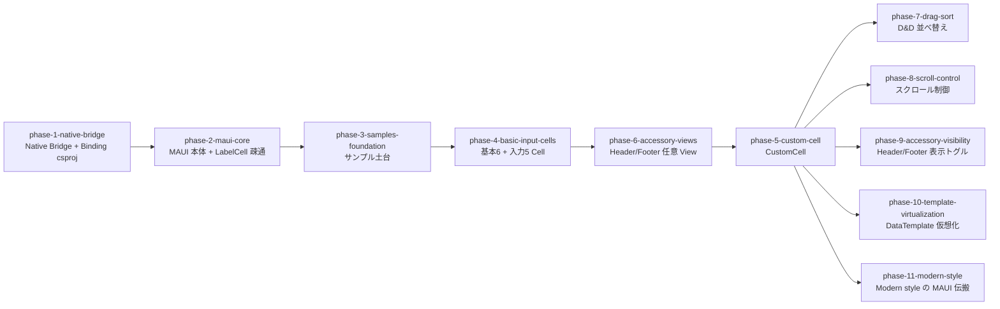

# MAUI 対応 (KsSettingsView.Maui)

既存の Native (iOS Swift / Android Kotlin) SettingsView を .NET MAUI から XAML/C# で利用できる `KsSettingsView.Maui` を、現行コア仕様に準拠した形で提供する。

旧 openspec 4 change (add-maui-bridge / add-maui-core / add-maui-cells / add-samples-maui) をフェーズ原案として再編したロードマップ。旧 change は凍結のまま参照のみ、記述が現行 concepts と食い違う場合は現行 concepts に従う。

## ゴール / 非ゴール

### ゴール

- MAUI (net10.0-ios / net10.0-android) から全 13 Cell (基本7 + 入力5 + Custom1) を BindableObject + Handler で利用できる
- Root / Section の Header・Footer を MAUI から設定できる (text および任意 MauiView。RootHeader / RootFooter は原典 AiForms に無い本ライブラリ固有の概念)
- Native 側に薄い Bridge 層 (`@objc` / `@JvmStatic`) と Binding csproj を新設する
- 構造変更は `SettingsRootDiff` 経路 (replaceCells バッチ含む) で部分更新できる
- `samples/maui/` に動作デモを提供する
- Native 起点の機能強化 (D&D 並べ替え / スクロール制御 / Header・Footer 表示トグル / DataTemplate 仮想化) を後続の強化フェーズとして提供する (AiForms 互換 API の踏襲ではなく Native からの再設計。maui/ADR-0008)

### 非ゴール

- Windows / Mac Catalyst 対応 (net10.0-ios / net10.0-android のみ)
- TextPickerCell の復活 (現行仕様に存在しない)
- Native (iOS/Android) Core・UI への **XAML 都合の新機能追加** (ItemsSource/ItemTemplate 等) — MAUI 層で閉じる。契約対称化などプラットフォーム間パリティのための追加はこの限りではない (例: iOS Store への `replaceCells` 追加、maui/ADR-0002)
- 旧 AiForms.Maui.SettingsView との完全 API 互換 (参考にはするが互換保証はしない)
- NuGet パッケージング (配布は NuGet 前提だが、パッケージングは配布要件が固まった時点で別途起こす。本ロードマップは ProjectReference での動作まで)

## 前提 / 制約

- 現行コア契約 (kasane/concepts/core/ の architecture・cells・styling) が正
- 原典参考コード: `../AiForms.Maui.SettingsView` (ローカルクローン済み)
- Native 側資産: iOS は `ios/` の Swift Package、Android は `android/ks-settingsview-ui` を土台にし、Bridge は別モジュールとして足す (既存公開 API は変えない)
- Binding は .NET の XcodeProject / AndroidGradleProject 形式 (Native Library Interop) を使う
- ターゲットは .NET 10 (net10.0-ios / net10.0-android)
- `openspec/` は凍結のまま。再編は kasane/roadmaps/ 側で行い、旧 change は編集しない
- phase-11-modern-style は Native 側の Modern 完全実装 (kasane/changes/implement-modern-style、ロードマップ外の L 級 change) の完了が前提

## 全体図

依存は直列。実行順は phase-4 → phase-6 → phase-5 (フェーズ番号は識別子であり実行順ではない)。phase-6 で MauiView→native 実体化機構を先に建て、phase-5 が再利用する。各 Cell フェーズ (4・5) と phase-6 はサンプルページ追加も自フェーズで持つ。phase-7〜10 は Native 起点の強化フェーズで、phase-5 までの完了後に順不同で着手できる。

## フェーズ一覧

| ID | 状態 | 種別 | フェーズ詳細 | Change |
|---|---|---|---|---|
| phase-1-native-bridge | completed | change | [agenda](phases/phase-1-native-bridge/agenda.md) | [changes/archive/2026-08-05-add-maui-native-bridge](../../changes/archive/2026-08-05-add-maui-native-bridge/proposal.md) |
| phase-2-maui-core | completed | change | [agenda](phases/phase-2-maui-core/agenda.md) | [changes/archive/2026-08-08-add-maui-core](../../changes/archive/2026-08-08-add-maui-core/proposal.md) |
| phase-3-samples-foundation | completed | change | [agenda](phases/phase-3-samples-foundation/agenda.md) | [changes/archive/2026-08-09-add-maui-samples-foundation](../../changes/archive/2026-08-09-add-maui-samples-foundation/proposal.md) |
| phase-4-basic-input-cells | completed | change | [agenda](phases/phase-4-basic-input-cells/agenda.md) | [changes/archive/2026-08-11-add-maui-basic-input-cells](../../changes/archive/2026-08-11-add-maui-basic-input-cells/proposal.md) |
| phase-6-accessory-views | completed | change | [agenda](phases/phase-6-accessory-views/agenda.md) | [changes/archive/2026-08-12-add-maui-accessory-views](../../changes/archive/2026-08-12-add-maui-accessory-views/proposal.md) |
| phase-5-custom-cell | completed | change | [agenda](phases/phase-5-custom-cell/agenda.md) | [changes/archive/2026-08-12-add-maui-custom-cell](../../changes/archive/2026-08-12-add-maui-custom-cell/proposal.md) |
| phase-7-drag-sort | pending | change | [agenda](phases/phase-7-drag-sort/agenda.md) | — |
| phase-8-scroll-control | pending | change | [agenda](phases/phase-8-scroll-control/agenda.md) | — |
| phase-9-accessory-visibility | completed | change | [agenda](phases/phase-9-accessory-visibility/agenda.md) | [changes/archive/2026-08-19-add-accessory-visibility-toggle](../../changes/archive/2026-08-19-add-accessory-visibility-toggle/proposal.md) |
| phase-10-template-virtualization | pending | change | [agenda](phases/phase-10-template-virtualization/agenda.md) | — |
| phase-11-modern-style | completed | change | [agenda](phases/phase-11-modern-style/agenda.md) | [changes/archive/2026-08-20-add-maui-modern-style](../../changes/archive/2026-08-20-add-maui-modern-style/proposal.md) |
