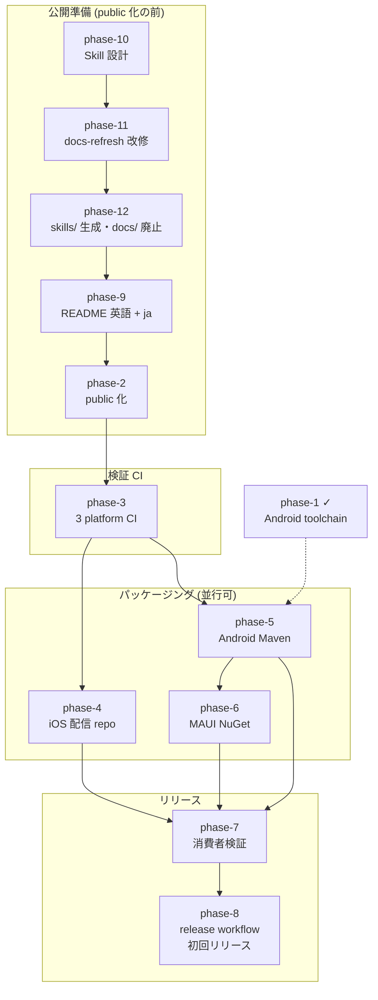

# パッケージ配信 (package-distribution)

KsSettingsView の 3 platform (iOS Swift / Android Kotlin / .NET MAUI) を公開レジストリへ lockstep で配信できる仕組み (パッケージング・検証・リリース CI) を整備し、初回リリースまで到達する。

ksn-explore (2026-08-21) で配信先・バージョニング・各 platform のパッケージ形・CI・検証方法を確定した上で起案した ([exploration.md](exploration.md))。設計の正は proposed ADR 群 (下記) で、accepted への昇格は各フェーズの蒸留時に行う (蒸留を伴わない research フェーズ由来の ADR は、フェーズ完了時にオーナーの明示承認で昇格する)。姉妹ライブラリ KsDialogs の先行設計 (KsDialogs cross/ADR-0008・0009、maui/ADR-0004) の翻案であり、CI・検証 (phase-3・7・8) は本ロードマップが先行して KsDialogs へ逆流させる。

## ゴール / 非ゴール

### ゴール

- iOS (SwiftPM 配信リポジトリの umbrella product `KsSettingsView`)、Android (`jp.kamusoft:kssettingsview`)、MAUI (`KsSettingsView.Maui`) を公開レジストリから 1 点の依存で導入できる ([cross/ADR-0018](../../decisions/cross/0018-distribution-public-channels-root-swiftpm-manifest.md)、[android/ADR-0016](../../decisions/android/0016-single-module-single-maven-artifact.md)、[maui/ADR-0025](../../decisions/maui/0025-nuget-three-package-root-namespace.md))
- 単一 version で全 platform を 1 回の手動起動で一斉リリースでき、tag は publish 全成功後にのみ生まれる ([cross/ADR-0019](../../decisions/cross/0019-lockstep-single-version.md)、[cross/ADR-0020](../../decisions/cross/0020-release-dispatch-tag-last-version-injection.md))
- 配布物を参照する消費者プロジェクト (`verification/`) で配信経路が検証されている (publish 前の dry-run と publish 後の smoke)
- PR / push で 3 platform のビルド・テストを回す検証 CI がある
- リポジトリが public である (機密情報・個人情報の混入チェック後)
- 利用者向けドキュメントが `docs/` ではなく、利用者が自分のプロジェクトへコピーして使える Skills (`skills/`、英語 / 日本語の 2 版) として提供され、docs-refresh がそれを manifest 方式の差分更新で kasane/concepts/ とコード・テストに追従させる道具になっている。`docs/` は廃止され、cross/ADR-0014 は新 ADR で supersede されている
- public 化の前に、英語 README + `README_ja` (原典 AiForms の運用を踏襲) にインストール手順 (確定済み識別子で記述、初回リリースまでは「未配信」の状態表記つき) と AiForms からの移行ガイドがあり、初回リリース時に状態表記を解除する

### 非ゴール

- private 配信経路 (GitHub Packages 等)
- iOS の binary (xcframework) 配布と umbrella module (`@_exported import`) — 要望が出た時点で ADR-0018 を見直す
- `kssettingsview-bridge` module の Maven 公開
- ライブラリの機能追加 (maui-support の pending フェーズ 7 / 8 / 10 は別ロードマップのまま)
- KsDialogs への適用 (成果の逆流は KsDialogs 側の phase-11 で行う)
- `skills/` と README 群の自発更新 (docs-refresh はユーザーの明示依頼で起動する。phase-12 と phase-9 がその依頼を出すフェーズ)
- Skill の配布パッケージング (plugin / marketplace 形式、バージョン管理) — `skills/` からのコピー利用のみ
- Kasane (開発ハーネス側) のスキルやその配布の変更

## 前提 / 制約

- 設計の正は proposed ADR 群: cross/0018・0019・0020、android/0016、maui/0025。実装で覆る知見が出たら ADR を改訂してから進める
- SwiftPM は monorepo を直接解決させず、**SwiftPM 専用の配信リポジトリ**へ release CI が `ios/` (Package.swift / Sources / Tests) のスナップショットを commit し同じ version の tag を push する (ADR-0018、2026-08-21 改訂)。monorepo のルートに Package.swift は置かず、cross/ADR-0001 への例外は不要。配信リポジトリの作成とスナップショット生成は phase-4、release workflow への組み込みは phase-8
- public 化は既存 private リポジトリの履歴を引き継がず新規リポジトリで行い、旧リポジトリは rename → archive する ([cross/ADR-0021](../../decisions/cross/0021-public-repository-fresh-start.md))。phase-2 の [実施手順書](phases/phase-2-public-readiness/artifacts/publish-procedure.md) に従う
- 版の表現: 開発用既定値は SNAPSHOT / dev、リリース version は dispatch 入力で CI が注入する (ADR-0020)。prerelease は `X.Y.Z-{alpha|beta|rc}.N` に統一する (`-pre` / `-preview` は Maven の版比較で正式版より新しいと判定されるため使わない)
- phase-5 (Android module 統合・dir 改名) と phase-6 (MAUI 名前空間改名) は広範な rename を伴うため、maui-support 側の change と同時進行させない (マージ衝突回避のため順序を調整する)
- phase-1 (toolchain) は phase-5 と同じ `build.gradle.kts` を触るため、phase-5 の着手前に完了させる
- public 化 (phase-2 の実施) は、利用者向けドキュメントを `docs/` から `skills/` へ置き換える phase-10〜12 と README 改訂 (phase-9) の完了後に行う — 公開リポジトリの履歴に旧 `docs/` と旧 README を一度も載せないため。phase-2 の議論・手順書の準備は先行してよい。phase-9 のインストール手順は確定済み識別子で先に書き、初回リリース (phase-8) で「未配信」の状態表記を解除する
- 知識の正は `kasane/concepts/` とコード・テスト。`skills/` はそこから利用者向けに翻訳した派生物で手で直接育てない (cross/ADR-0014 の原則を対象を変えて引き継ぐ)。Skill の形式は Agent Skills 標準 (`SKILL.md` + frontmatter、必要なら `references/`) でどの実行系でもコピーして読める形。docs-refresh (`.agents/skills/docs-refresh/`) は場所を変えず対象を `skills/` + README 群に、manifest を `skills/.manifest.json` に移す。起動はユーザーの明示依頼のみ (自動発動禁止) を維持
- public 化 (phase-2) は CI 構築 (phase-3 以降) の前に行う: public リポジトリでは GitHub Actions の標準ランナー (macOS 含む) が無料で、SwiftPM の https 実リモート検証も最初からできる

## 全体図

phase-10 → 11 → 12 (Skills 化) → phase-9 (README) → phase-2 の実施 (public 化) の順。phase-1 は独立 (完了済み)。phase-4 と phase-5 は phase-3 の後で並行可 (ただし phase-5 は phase-1 完了後)。

## フェーズ一覧

| ID | 状態 | 種別 | フェーズ詳細 | Change |
|---|---|---|---|---|
| phase-1-android-build-toolchain | completed | change | [agenda](phases/phase-1-android-build-toolchain/agenda.md) | [changes/archive/2026-08-21-upgrade-android-build-toolchain](../../changes/archive/2026-08-21-upgrade-android-build-toolchain/proposal.md) |
| phase-10-skills-design | completed | research | [agenda](phases/phase-10-skills-design/agenda.md) | — |
| phase-11-docs-refresh-retarget | completed | change | [agenda](phases/phase-11-docs-refresh-retarget/agenda.md) | [changes/archive/2026-08-26-retarget-docs-refresh-to-skills](../../changes/archive/2026-08-26-retarget-docs-refresh-to-skills/proposal.md) |
| phase-12-skills-rollout | completed | change | [agenda](phases/phase-12-skills-rollout/agenda.md) | [changes/archive/2026-08-28-rollout-user-skills](../../changes/archive/2026-08-28-rollout-user-skills/proposal.md) |
| phase-9-docs | completed | change | [agenda](phases/phase-9-docs/agenda.md) | [changes/archive/2026-08-30-consolidate-readmes-and-contribution](../../changes/archive/2026-08-30-consolidate-readmes-and-contribution/proposal.md) |
| phase-2-public-readiness | completed | research | [agenda](phases/phase-2-public-readiness/agenda.md) | [changes/archive/2026-08-30-add-question-form-and-english-screenshots](../../changes/archive/2026-08-30-add-question-form-and-english-screenshots/proposal.md) |
| phase-3-verification-ci | completed | change | [agenda](phases/phase-3-verification-ci/agenda.md) | [changes/archive/2026-08-31-add-verification-ci](../../changes/archive/2026-08-31-add-verification-ci/proposal.md) |
| phase-4-ios-packaging | completed | change | [agenda](phases/phase-4-ios-packaging/agenda.md) | [changes/archive/2026-09-01-add-spm-distribution](../../changes/archive/2026-09-01-add-spm-distribution/proposal.md) |
| phase-5-android-packaging | pending | change | [agenda](phases/phase-5-android-packaging/agenda.md) | — |
| phase-6-maui-packaging | pending | change | [agenda](phases/phase-6-maui-packaging/agenda.md) | — |
| phase-7-consumer-verification | pending | change | [agenda](phases/phase-7-consumer-verification/agenda.md) | — |
| phase-8-release-workflow | pending | change | [agenda](phases/phase-8-release-workflow/agenda.md) | — |
